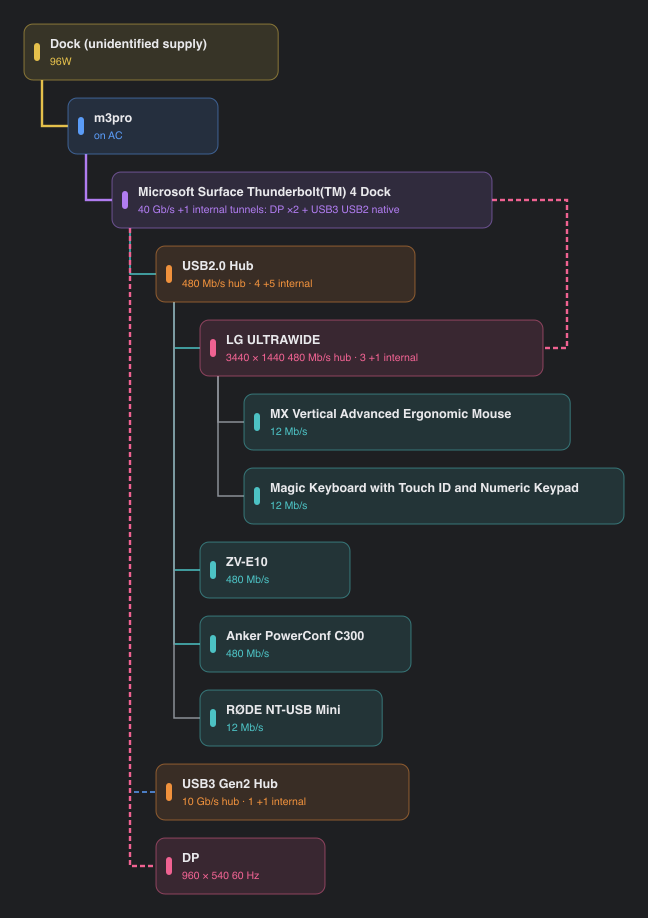

# Connection Dashboard

One React UI for the connection-diagnostics family — [TBDoctor](https://github.com/mhuot/tbdoctor)
(macOS) and [ConnectionDoctor](https://github.com/mhuot/connectiondoctor) (Windows) — reading the
shared **Connection Contract v1** (`tbdoctor/docs/schema-v1.md`).

Spec-driven with [OpenSpec](https://github.com/Fission-AI/OpenSpec): see
`openspec/changes/add-react-dashboard/` for the proposal, design (including the
recorded decision to go web-first React + Tauri later, with React Native
evaluated and rejected), capability specs, and task list.



## Run

```sh
cd app
npm install
npm run dev     # then drop contract .json / events .jsonl files, or "Load fleet fixtures"
npm test        # 27 tests: contract ingest, topology collapse, layout invariants, migrations
```

## What works today

- **Contract ingest** — schema-gated, unknown-field tolerant, orphans flagged
  not dropped, JSONL skip-counting, evidence-mandatory findings, and "USB 2.0
  is never tunneled" enforced rather than trusted.
- **Topology view** — three layouts, physical/logical collapse, protocol
  colours, honest tunneling dashes, text-sized boxes, node inspector with
  VID:PID lookup. The layout engine is a pure-TS port of TBDoctor's, covered
  by invariant tests (no overlaps, orthogonal edges, in-canvas).
- **Timeline view** — event-derived device-count steps, root-event rules,
  incident stitching with shared-parent attribution.
- **Fleet view** — hosts side by side plus **cross-host migration detection**:
  a KVM moving a monitor's hub (and everything behind it) renders as one
  branch migration, not five device events. Count-matched for duplicate
  hardware; remove-must-precede-add.

Fixtures are real recordings from this fleet: an M3 Pro on a Surface TB4 dock
chain, and the Mac mini's actual KVM flip at 22:19:06Z.

## Next (per tasks.md)

Wire HttpSource UI once collectors emit v1 (tbdoctor#1 / connectiondoctor#15),
then a Tauri wrap as its own OpenSpec change.
