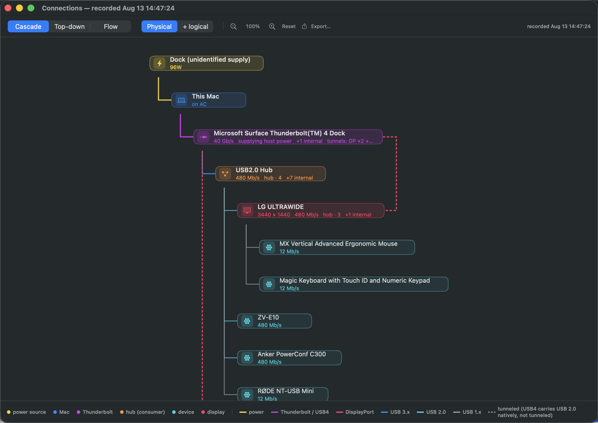
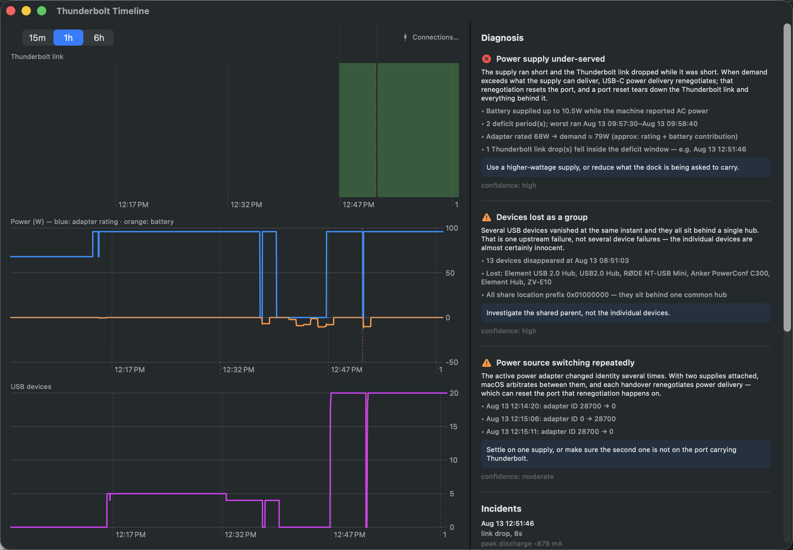
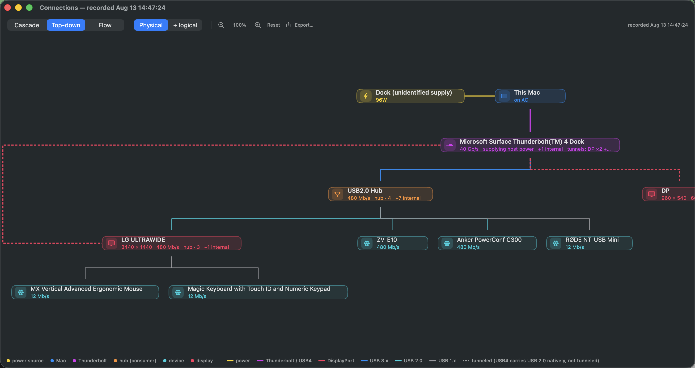
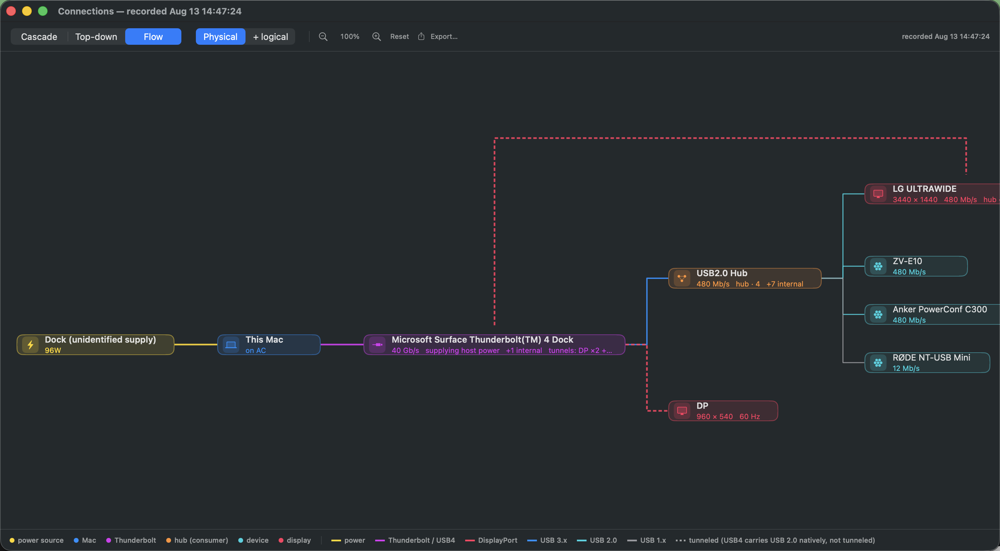
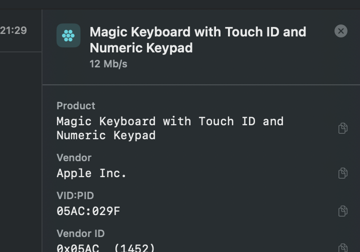
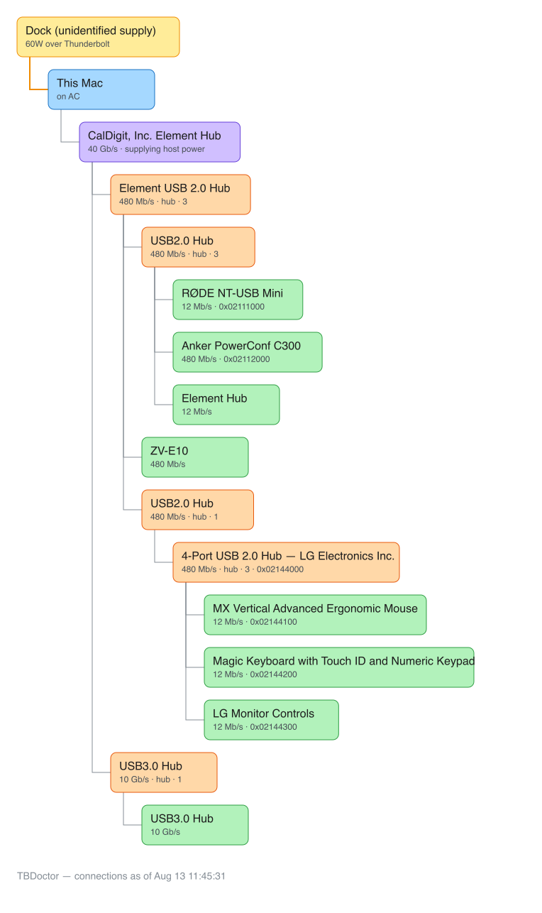

# TBDoctor

Finds the root cause of Thunderbolt dock, USB peripheral and power faults on macOS —
the "my dock keeps disconnecting" and "my devices randomly drop" class of problem.




Built after a CalDigit Element Hub kept dropping a keyboard, mouse, monitor hub, mic
and two cameras. The cause turned out to be a power supply that could not cover the
laptop's demand: when demand exceeds supply, USB-C power delivery renegotiates, that
renegotiation resets the port, and a port reset tears down the Thunderbolt link and
everything behind it. Nothing on macOS correlates the four data sources needed to see
that, so this does.

## Why a tool

The failure is intermittent and hits while you are busy — mid-call, mid-build. By the
time you look, it is over. So TBDoctor records continuously and reconstructs the fault
afterwards, rather than being a dashboard you have to already be watching.

It also does the part that is genuinely hard: telling a **root** event from its
**fallout**. One dropped Thunderbolt link produces hundreds of downstream USB errors,
and reading those logs naively points you at whichever innocent device happens to be
noisiest. (While diagnosing the original fault by hand, that trap produced two wrong
answers before the right one.)

## What it detects

| Finding | Signature |
|---|---|
| Power supply under-served | Battery discharging while the machine reports AC power |
| Power-induced link drop | A Thunderbolt link drop landing inside a power-deficit window |
| Cable / signal integrity | Link drops with *no* deficit nearby, often at a regular sub-second cadence |
| Grouped device loss | Several USB devices vanishing together behind a shared hub |
| Supply arbitration | The active adapter's identity flipping repeatedly between two sources |
| Headroom warning | Peak demand at or above the adapter's rating, before anything fails |

Every finding carries the evidence that produced it. A verdict you cannot audit is
just an opinion, and these failure modes are easy to get confidently wrong.

## Install

```sh
./build_app.sh
open TBDoctor.app
```

Add it to Login Items (System Settings → General → Login Items) so it is recording
before you need it.

## Dashboard

The [Connection Dashboard](https://github.com/mhuot/connection-dashboard) — the
same React UI ConnectionDoctor serves on Windows — is compiled into the binary.
Nothing to install alongside it, no Node, no second app:

```sh
TBDoctor.app/Contents/MacOS/TBDoctor --serve     # then open http://localhost:8787
```

The page connects to the machine serving it, so the topology is on screen with
nothing to type. Add `--bind lan` to view the fleet from another machine; that
is unauthenticated read-only telemetry and opt-in by design.

Rebuilding the embedded UI needs Node, and only for whoever builds a release:

```sh
scripts/build-ui.sh    # builds ../connection-dashboard and stages dist
./build_app.sh
```

A build with nothing staged still works; `/` then explains that instead of
serving a UI.

## Menu bar

A status symbol — shape-coded as well as colour-coded, so it stays readable in a
monochrome menu bar. Click for current Thunderbolt link, adapter identity and
wattage, battery current, USB device count, the leading root cause, and the last
incident. "Open timeline…" gives charts of link state, power and device count with
root events marked, alongside the full findings list.



The screenshot above is a real diagnosis from the day this was written: a 68W-rated
adapter against ~79W of demand, the battery quietly covering the difference while
the machine reported AC power, and a Thunderbolt link drop landing inside that
deficit window.

## Command line

```sh
TBDoctor.app/Contents/MacOS/TBDoctor --probe     # current state, once
TBDoctor.app/Contents/MacOS/TBDoctor --tree      # connection tree + where power enters
TBDoctor.app/Contents/MacOS/TBDoctor --report    # analyse history, print findings
TBDoctor.app/Contents/MacOS/TBDoctor --watch     # live one-line-per-sample table
TBDoctor.app/Contents/MacOS/TBDoctor --inspect samples.jsonl   # draw a recorded tree
TBDoctor.app/Contents/MacOS/TBDoctor --excalidraw out.excalidraw --style flow
TBDoctor.app/Contents/MacOS/TBDoctor --serve      # dashboard + contract endpoints
```

`--inspect` opens the connection tree for a *recorded* sample instead of live
hardware, so you can look at a capture from another machine. A dock that
misbehaves on one Mac and not another is a common shape for this fault, and the
two trees side by side are the fastest way to see why.

## Connections

A resizable window (menu bar → Connections…, or the button in the timeline)
drawing the physical topology as boxes joined by right-angle connectors: power
source, host, Thunderbolt device, then the USB hierarchy rebuilt from
location-ID nibbles. It exists because this is the part people misread — a
monitor with a built-in hub looks like infrastructure, and the devices behind it
look directly attached.

**Physical / + logical** toggle. Physical shows only enclosures you could point
at — internal hubs, control interfaces and controller silicon fold into the box
they live in, with a `+N internal` badge so nothing is hidden silently. A
daisy-chained dock's peripherals are reparented under that dock, since the USB
tree nests them under the *upstream* dock purely as an artifact of tunneling.

**Links are coloured by protocol** — power, Thunderbolt/USB4, USB 3.x, USB 2.0,
USB 1.x — and **dashed when tunneled over Thunderbolt**. That makes two things
visible at a glance that previously took real effort: whether Thunderbolt is
actually carrying anything, and that every peripheral is stuck on USB 2.0.

Three layouts, switchable and remembered between launches:

| Layout | Shape | Good for |
|---|---|---|
| **Cascade** | Each child steps down and right | Narrow; grows downward. The default. |
| **Top-down** | Children fan out below, power enters from the left | Reads as a schematic |
| **Flow** | Left to right: power, Mac, dock, hubs, devices | Matches how you'd describe a dock chain |





Secondary DisplayPort edges route *outside* the tree's footprint — down a side
margin in top-down, over the top in flow — because a tree can express only one
parent per node, and a monitor with a hub genuinely has two connections.

The power path is drawn in amber and separately from the data tree, so where
power enters is never confused with what carries data. Boxes are sized to their
text rather than fixed — truncating "4-Port USB 2.0 Hub — LG Electronics Inc."
throws away the one word identifying the hardware. Hubs that self-describe as
"Generic" are resolved by matching their vendor ID against their own children,
which is how that anonymous hub becomes identifiably the LG monitor's.

Clicking any box opens an inspector with everything IOKit publishes about it —
vendor and product IDs, serial, USB class/subclass/protocol, USB version, device
release, negotiated speed and link rate, location ID, USB address — each row
copyable, plus a one-click lookup on a public USB ID database.

That matters because hubs routinely name themselves uselessly. Three different
boxes here call themselves "USB2.0 Hub"; their VID:PIDs identify them as CalDigit,
Genesys Logic and Intel silicon respectively. `--probe` prints the same VID:PID
column for research over SSH.



The VID:PID pair is the identifier worth having: assigned by USB-IF, identical on
every OS, and searchable in public databases — it identifies hardware whose own
name identifies nothing. (The same pair later matched these devices one-for-one in
Windows Device Manager on a Surface, where instance IDs carry `VID_xxxx&PID_xxxx`.)

`--tree` prints the same topology as text.

### Excalidraw export

**Export…** in the toolbar (or `--excalidraw out.excalidraw [--style ...]`) writes
the diagram as an Excalidraw document, reusing the same layout engine so the file
matches what was on screen. Boxes, orthogonal connectors and the amber power path
come across as native Excalidraw elements — editable, annotatable and shareable,
which is what you usually want when handing a topology to someone else.

Colours are remapped to Excalidraw's own palette, since the app's dark-background
tints are illegible on its white canvas. Text is free-floating rather than
container-bound: bound text gets centred and re-wrapped, which would undo the
left-aligned title/detail stacking. Element seeds are deterministic, so
re-exporting the same topology produces a diffable file instead of churning
every element.

Agents can request one directly via the `tb_diagram` MCP tool.




Note that IOKit exposes no per-device power draw on current hardware, so the
diagram shows where power *enters* and which nodes are consumers — it does not
invent per-device wattages.

## Use from a coding agent

TBDoctor is an MCP server, so Claude Code, Claude Desktop, Copilot in VS Code and
Cursor can query the hardware directly instead of being handed pasted terminal output.

```sh
claude mcp add tbdoctor -- /full/path/to/TBDoctor.app/Contents/MacOS/TBDoctor --mcp
```

Tools: `tb_probe` (current state), `tb_diagnose` (ranked findings with evidence),
`tb_incidents` (reconstructed fault history), `tb_diagram` (the topology as an
Excalidraw document).

## How it works

Sampled from IOKit every 5s, tightening to 1s for a minute after any kernel event —
resolution matters exactly when something is happening.

| Source | Read |
|---|---|
| `IOThunderboltSwitch*` | Attached devices, vendor, model, depth, route |
| `IOThunderboltPort` | `Link Bandwidth` in units of 0.1 Gb/s |
| `IOPSCopyExternalPowerAdapterDetails` | Adapter watts, ID, serial, manufacturer |
| `AppleSmartBattery` | `ExternalConnected`, `InstantAmperage`, `Voltage` |
| `IOUSBHostDevice` | Device tree with negotiated speeds |
| `log stream` | Link and port kernel events |

Data lives in `~/Library/Application Support/TBDoctor/` as JSONL, trimmed at 24MB.
Override with `TBDOCTOR_DIR`.

## Implementation notes

Things that were not obvious, recorded so they are not re-learned the hard way:

- **Thunderbolt switches do not share one class name.** The host controllers here are
  `IOThunderboltSwitchType7`; the attached CalDigit dock is
  `IOThunderboltSwitchIntelJHL8440` — named after the *device's* controller silicon.
  Matching an enumerated list of class names silently misses hardware, so TBDoctor
  matches the substring `ThunderboltSwitch`. This bug made the dock invisible.

- **`ioreg` renders `InstantAmperage` as an unsigned 64-bit wrap.** A 4.4A discharge
  prints as `18446744073709547204`. IOKit stores it signed; read it via `int64Value`
  and it is simply `-4412`.

- **The adapter drops out *during* a fault.** An earlier deficit detector required the
  adapter to be continuously present and so broke its run at exactly the diagnostic
  moments — the fault read as healthy. Runs now tolerate gaps and are qualified as a
  whole.

- **`log stream` drops messages under burst load**, which is precisely when a fault is
  happening. The predicate is kept narrow and a periodic `log show` sweep backfills.

- **`log` logs itself.** Running a query whose predicate contains "overcurrent" puts
  the word "overcurrent" in the log. This produced a phantom finding during the
  original investigation; those lines are now filtered.

- **Total demand is an upper bound.** It is the adapter's *rating* plus the battery's
  contribution, and a struggling adapter may not be delivering its rating. The
  battery contribution is measured; the total is labelled as inferred.

## Limits

- Link speed is reported per-link, taking the fastest active port. Exact for a single
  dock; a daisy chain reports the fastest hop rather than per-device speeds.
- Ad-hoc signed. Fine locally; needs a Developer ID identity to distribute.
- Tested against the hardware it was written on: an M5 Pro and an M3 Pro MacBook Pro,
  a CalDigit Element Hub, a Microsoft Surface Thunderbolt 4 Dock (singly and
  daisy-chained), an LG UltraWide with built-in hub, and the usual desk clutter of
  cameras, mics and input devices. The class-name matching above is the main
  portability risk on other silicon.
- macOS only. See below.

## Why Windows needs this tool too

The same class of fault was debugged the same week on a Surface Laptop 7
(Snapdragon X) — same dock, same monitor, same peripherals — and the experience
made the case better than any argument: it was all manual PowerShell, Device
Manager spelunking, and photographing screens. The failure (a monitor's USB hub
wedged after a host switch; video fine, hub dead) was eventually cured by
power-cycling the monitor, but nothing on Windows could *say* that.

What a Windows counterpart would read, mapped from what TBDoctor reads:

| TBDoctor (macOS) | Windows equivalent |
|---|---|
| `IOThunderboltSwitch*` registry entries | USB4 router devnodes via CfgMgr32 (`CM_Get_Parent` walks the topology); USB4 host router events |
| `log stream` kernel predicates | ETW: `Microsoft-Windows-USB-USBHUB3`, `-USBXHCI`, `-USB-UCX`, `Kernel-Power` |
| `AppleSmartBattery` amperage | WMI `Win32_Battery` / `BatteryStatus` — discharge-while-plugged-in is the same tell |
| `IOPSCopyExternalPowerAdapterDetails` | UCSI / power delivery events; `powercfg /systempowerreport` |
| CoreGraphics display list | `QueryDisplayConfig` for active DP/HDMI paths |

Ranked by what would have actually helped, from the live debugging session:

1. **Present-vs-ghost discrimination.** `Get-PnpDevice` returns every device the
   machine has *ever* seen; a screenful of `Unknown`-status ghosts derailed the
   diagnosis for a round. `-PresentOnly` semantics must be the default, with
   ghosts available as history — which is genuinely useful signal, not noise.
2. **Baseline diff.** The dock moves between three hosts. "Here is the known-good
   topology from the last time this worked; here is what is missing right now"
   answers the host-switch question in one command. (The VID:PID checklist that
   solved the Surface case was hand-built from TBDoctor's recording.)
3. **Continuous recording + root-vs-fallout stitching.** Identical rationale to
   macOS: the fault hits while you are busy, and one hub reset produces a cascade
   of downstream errors that point at innocent devices.
4. **Sleep-state awareness.** On Windows the first suspect for "everything died
   when I closed the lid" is the lid action and Modern Standby (S0ix powers down
   USB4 controllers), not the dock. A tool that checks `powercfg` state before
   blaming hardware skips a whole wrong turn.
5. **ARM-specific notes.** Snapdragon X machines do USB4 with DP and USB3
   tunneling but in practice fail PCIe tunneling (eGPUs, TB NVMe enclosures show
   up broken or not at all). Worth detecting and saying explicitly, because "ARM
   doesn't do Thunderbolt" is the folk explanation and it is wrong — the dock
   enumerated as a USB4 router and worked.

The MCP server would port as-is — it is stdio JSON-RPC with no platform
dependencies — so agents would get `tb_probe`/`tb_diagnose`/`tb_incidents` on
Windows unchanged.
